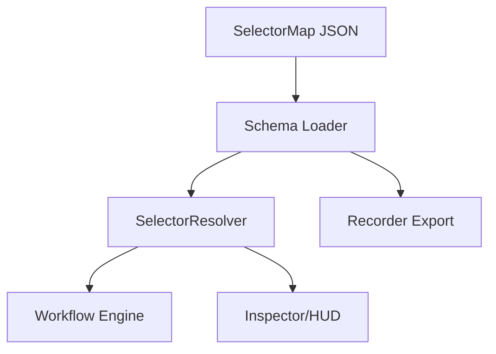

\# Design Document

\## Overview

The selector system & resolver deliver a shared contract for page modules, recorder exports, and the workflow engine. A per-site SelectorMap JSON encodes ordered locator strategies, stability metadata, and optional scope containers. The runtime resolver consumes this schema to locate DOM nodes deterministically, recording telemetry and triggering graceful degradation when elements disappear. Tooling hooks (recorder, inspector, HUD) read the same schema to surface scores, tags, and notes.

\## Steering Document Alignment

\### Technical Standards (tech.md)
- TypeScript strict types define `SelectorMap`, `SelectorStrategy`, and resolver outputs, ensuring the monorepo maintains typed contracts.
- Resolver relies only on native DOM APIs, aligning with the no-3rd-party-selector constraint and avoiding unsafe evals for XPath.
- Logging uses the standard `[DGX]` prefix and sanitizer utilities for consistency with existing observability guidance.
- Performance guardrails (≤150ms polling, bounded retries) match the project’s wait utilities and GM-friendly runtime expectations.

\### Project Structure (structure.md)
- JSON schemas live under `packages/selectors`, matching the documented repo structure; types and validators reside alongside to keep ownership clear.
- Resolver logic extends `packages/core` (`resolve.ts`, `utils/dom.ts`), respecting module boundaries that isolate DOM utilities from recorder UI.
- Recorder/inspector packages consume the schema via `@selectors` alias ensuring cross-target parity for userscript and MV3 builds.

\## Code Reuse Analysis

Existing modules already provide DOM querying (`packages/core/utils/dom.ts`), logging (`debug.ts`), and workflow types (`packages/workflows/types.ts`). The new feature layers schema validation, resolution orchestration, stability scoring, and telemetry on top of these utilities.

\### Existing Components to Leverage
- **@core/utils/dom**: use `byRole`, `byText`, `byDataAttr`, `byCss`, `byXpath` helpers for concrete strategy execution.
- **@core/utils/wait**: reuse retry/backoff helpers when integrating resolver misses into workflow execution.
- **@core/debug**: extend structured logging with resolver context.
- **@recorder/selector-suggest**: enhance to emit stability scores/notes that align with schema expectations.

\### Integration Points
- **Workflow Engine (@workflows/engine)**: inject resolver to fetch DOM nodes per step; capture resolving strategy for observability.
- **Recorder (@recorder/to-workflow)**: map recorded strategies into schema-compliant JSON and update scores/tags.
- **HUD/Inspector (@inspector/overlay)**: surface stability scores and miss telemetry within the UI.

\## Architecture

The system centers around three layers: schema definition/validation, resolver execution, and telemetry/reporting. Selector maps load at page module init, validated once, then cached. When workflows or tools request a logical key, resolver iterates strategies in order, optionally scoping the search root via `scopeKey`. Telemetry hooks capture success/failure data and stability signals, letting HUD/recorder react.

\### Modular Design Principles
- **Single File Responsibility**: `selector-schema.ts` handles schema types/validation; `resolver.ts` executes strategy resolution; `resolver-telemetry.ts` manages logging and event emission.
- **Component Isolation**: JSON schema utilities remain read-only modules; mutation logic lives in recorder exporters.
- **Service Layer Separation**: Resolver core purely returns results; workflow engine decides retry/backoff; HUD handles presentation of misses.
- **Utility Modularity**: Each locator helper (role/text/dataAttr/css/xpath) stays in `utils/dom.ts`; resolver orchestrates rather than re-implements.



\## Components and Interfaces

\### Component 1 — Schema Loader (`packages/selectors/schema.ts`)
- **Purpose:** Parse and validate SelectorMap JSON against TypeScript types and runtime guards.
- **Interfaces:** `loadSelectorMap(siteId: string): SelectorMap`, `validateSelectorMap(data: unknown): SelectorMap`.
- **Dependencies:** Node `JSON.parse`, `zod` or custom validator (if already present). Avoids DOM access.
- **Reuses:** Type definitions from `@selectors/types` shared with recorder/workflows.

\### Component 2 — Resolver Core (`packages/core/resolve.ts`)
- **Purpose:** Resolve logical keys to DOM elements using ordered strategies and optional scoped containers.
- **Interfaces:** `resolve(map: SelectorMap, key: string, opts?: ResolveOptions): ResolveResult`.
- **Dependencies:** `@core/utils/dom` helpers, telemetry hooks.
- **Reuses:** Workflow engine integration points; existing wait/retry utilities.

\### Component 3 — Telemetry Hooks (`packages/core/resolve-telemetry.ts`)
- **Purpose:** Emit structured logs/events for successes and misses, include stability score/tags.
- **Interfaces:** `createResolverLogger(source: ResolverSource): ResolverLogger` returning `logAttempt`, `logSuccess`, `logMiss` functions.
- **Dependencies:** `@core/debug`, optional HUD event bus.
- **Reuses:** Logging conventions and sanitizer utilities.

\### Component 4 — Recorder Merger (`packages/recorder/selector-merge.ts`)
- **Purpose:** Merge recorder suggestions with existing selector maps, preserving metadata order.
- **Interfaces:** `mergeSelectorEntry(map: SelectorMap, key: string, update: SelectorEntry): SelectorMap`.
- **Dependencies:** Schema types and inspector scoring outputs.
- **Reuses:** Existing recorder export pipeline.

\## Data Models

\### SelectorMap Types (`packages/selectors/types.ts`)
```
type SelectorStrategy =
  | { type: "role"; role: string; name?: string }
  | { type: "text"; text: string; exact?: boolean }
  | { type: "dataAttr"; key: string; value?: string }
  | { type: "css"; css: string }
  | { type: "xpath"; xpath: string };

type SelectorTry = SelectorStrategy & {
  stabilityScore?: number;
  notes?: string;
  uniqueInScope?: boolean;
};

type SelectorEntry = {
  description?: string;
  scopeKey?: string;
  tags?: string[];
  stabilityScore?: number;
  tries: SelectorTry[];
};

type SelectorMap = Record<string, SelectorEntry>;
```

### Resolve Result (`packages/core/resolve.ts`)
```
type ResolveResult = {
  element: Element | null;
  resolvedBy?: SelectorStrategy;
  attempts: Array<{ strategy: SelectorStrategy; success: boolean }>;
  scope?: { key?: string; root: ParentNode };
  stabilityScore?: number;
  metadata?: { tags?: string[]; description?: string };
};
```

\## Error Handling

### Error Scenarios
1. **Invalid Selector Schema**
   - **Handling:** Throw or return structured error during map loading with path-specific messages; prevent page module registration.
   - **User Impact:** Developer logs show schema validation failure; workflows skip registration to avoid runtime crashes.

2. **Resolver Miss at Runtime**
   - **Handling:** `ResolveResult.element` is null; telemetry logs miss with attempts; workflow engine triggers retry/backoff or fails step.
   - **User Impact:** HUD displays miss toast with logical key, tags, and last known strategy; recorder can flag key for review.

3. **Scoped Container Missing**
   - **Handling:** When `scopeKey` cannot resolve, log specific warning and fall back to document root if allowed; otherwise treat as miss.
   - **User Impact:** Workflow logs highlight missing container, hinting at structural changes.

\## Testing Strategy

### Unit Testing
- Validate schema parser with fixtures covering valid/invalid SelectorMap variations.
- Assert resolver stops at first success and records attempt order.
- Verify telemetry hooks receive expected payloads for success and miss paths.

### Integration Testing
- Run workflow engine with mocked DOM to ensure retries/backoff integrate with resolver results.
- Test recorder merge pipeline to confirm metadata preservation and ordering.

### End-to-End Testing
- Using demo page modules, execute workflows where elements exist/miss, confirming HUD logs and recorder diagnostics behave as expected.
- Simulate DOM changes to ensure graceful degradation flows (miss logging, stability display).
