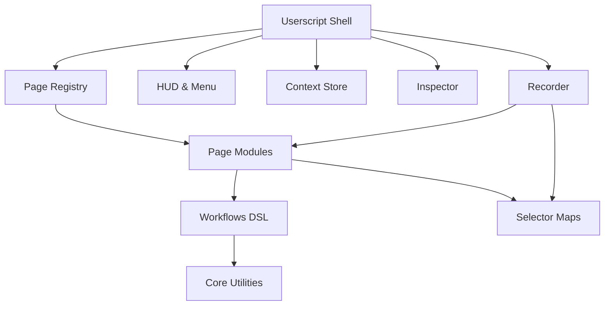

# DGX Modular Userscripts Foundation — Program Charter & Backlog Design

## Overview

Translate the approved charter into an implementation-agnostic delivery plan that maps streams, milestones, and acceptance bar to concrete spec artifacts without prescribing code-level detail.

## Steering Document Alignment

### Technical Standards (tech.md)
- Preserve TypeScript-only, Vite + vite-plugin-monkey userscript build and WXT MV3 parity with no webpack.
- Adhere to GM storage, BroadcastChannel sync, selector stability, performance caps (≤150 ms polling, ≤8 s timeouts), and privacy defaults (masking inputs, no remote telemetry).

### Project Structure (structure.md)
- Organize charter outputs by existing packages (`core`, `workflows`, `menu`, `context`, `selectors`, `inspector`, `recorder`, `scripts`) and apps directories (`apps/userscripts`, `apps/wxt-extension`).
- Reference docs set (`README.md`, `AGENTS.md`, `CONTRIBUTING.md`, `RECORDER.md`) as canonical documentation touchpoints.

## Code Reuse Analysis
- Emphasize reuse of existing package boundaries; backlog items should extend rather than duplicate.
- Highlight inspector/recorder modules as primary surfaces for recorder-first goals; workflows DSL and context store provide shared foundations.

### Existing Components to Leverage
- **packages/core**: DOM resolvers, waits, scroll/collect utilities.
- **packages/workflows**: DSL, engine, executor, logging.
- **packages/menu**: HUD + GM menu integration for command palette.
- **packages/context**: GM-backed context store with TTL and sync.
- **packages/selectors**: JSON selector maps, stability metadata.
- **packages/inspector**: Overlay, selector suggestions, stability scoring.
- **packages/recorder**: Event capture, mapping UI, export pipeline.
- **apps/userscripts** & **apps/wxt-extension**: Build pipelines ensuring parity.
- **Documentation**: README/AGENTS/RECORDER for onboarding and agent guidance.

### Integration Points
- **GM_* APIs + BroadcastChannel** for context sync across tabs.
- **HUD + Native Menus** to expose workflows and recorder toggles.
- **Selector Resolver** bridging selector maps with workflows engine.
- **Recorder Export** writing selectors JSON and page modules in scripts package.

## Architecture

- Maintain modular monorepo with shared packages; page modules stay declarative and leverage DSL steps.
- Ensure architecture supports Tampermonkey/Violentmonkey baseline with optional MV3 build reusing same code.
- Keep inspector/recorder layered atop selectors/workflows without cross-dependency loops (inspector suggests selectors, recorder writes outputs; core utilities remain dependency-free of UI).

### Modular Design Principles
- Single-responsibility packages per steering structure.
- Clear public interfaces via TypeScript types and index exports.
- Avoid platform-specific logic outside app shells; code stays environment-agnostic.

## Components and Interfaces

### Charter Document
- **Purpose:** Canonical reference for vision, goals, constraints, success metrics, risk mitigations.
- **Interfaces:** Sections covering vision, personas, goals, non-goals, architecture, glossary.
- **Dependencies:** Steering docs for authoritative scope, requirements acceptance criteria.
- **Reuses:** Terminology and constraints from product.md and tech.md.

### Backlog Streams
- **Purpose:** Grouped feature list guiding implementation sequencing.
- **Interfaces:** Stream definitions (Core, Workflows, UI/HUD, etc.), feature descriptions, links to milestones.
- **Dependencies:** Selector system, workflows DSL, HUD, context store, inspector, recorder packages.
- **Reuses:** Module boundaries to prevent duplication.

### Milestones & Acceptance Bar
- **Purpose:** Checklist for MVP vs post-MVP scope, shared definition of done across features.
- **Interfaces:** Milestone tables, acceptance bar bullet list.
- **Dependencies:** Backlog stream entries, steering success metrics, non-functional constraints.
- **Reuses:** Performance, reliability, privacy criteria from tech.md.

## Data Models

- No new runtime data structures defined; documents reference existing selector maps, workflow DSL types, and context store schema from steering docs.

## Error Handling

- Risks and mitigations captured directly in charter section; emphasis on guarding against selector drift, CSP failures, scroll loops, privacy leaks.
- Recorder and HUD error reporting rely on core logging patterns (structured `[DGX]` logs).

## Testing Strategy

- Align acceptance bar with required validation: cross-platform parity tests (Tampermonkey/Violentmonkey, optional MV3), workflow smoke tests, recorder replay verification.
- Encourage unit testing for core utilities, integration tests for workflows engine, manual HUD/recorder QA per steering QA checklist.
