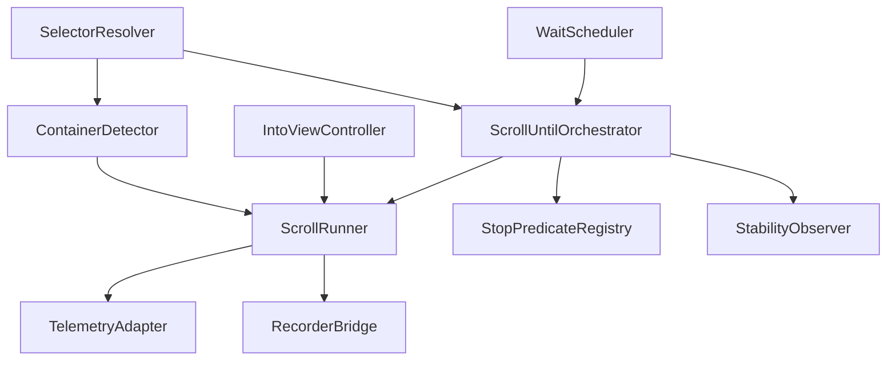

# Design Document

## Overview

The DGX scroll utilities expand the core scrolling toolkit with deterministic container detection, safe `scrollIntoView` alignment, and a configurable `scrollUntil` orchestrator. The design introduces modular services under `@core/utils/scroll` that coordinate resolver strategies, scrolling mechanics, telemetry, and recorder integrations while honoring performance budgets and sanitization rules. The resulting APIs enable workflows, recorder replays, and AI agents to automate infinite lists and dynamic feeds with end-to-end observability.

## Steering Document Alignment

### Technical Standards (tech.md)
- Implemented in strict TypeScript within `packages/core/utils/scroll`, re-exported through barrels while respecting dependency boundaries (core utilities depend on resolver, telemetry, recorder adapters).
- Enforces steering performance ceilings (≤150 ms jittered polling, ≤8 s timeout) and `[DGX]` telemetry guidance with sanitized payloads.
- Uses native DOM APIs (`scrollTo`, `requestAnimationFrame`, `IntersectionObserver`, `MutationObserver`) without introducing new third-party dependencies or unsafe evaluation.

### Project Structure (structure.md)
- Adds focused modules under `packages/core/utils/scroll` (`container.ts`, `into-view.ts`, `until.ts`, `metrics.ts`, `recording.ts`) with typed exports via `packages/core/index.ts`.
- Provides integration shims in `packages/recorder` and `packages/workflows` rather than coupling recorder logic into core utilities.
- Updates workflow engine actions under `packages/workflows/src/actions/scroll.ts` to consume the new helpers, preserving modular boundaries described in structure steering.

## Code Reuse Analysis

- **Selector Resolver (`@core/resolve`)**: Supplies logical selector lookups and strategy history for `mode: "element"` and container hints.
- **Wait Scheduler (`@core/utils/wait`)**: Provides timeout, attempt budgeting, and telemetry adapters reused for `scrollUntil` heartbeat scheduling.
- **Telemetry Adapter (`@workflows/telemetry`)**: Receives structured `[DGX] scroll:*` events for HUD timelines and recorder playback summaries.
- **Recorder Serialization (`@recorder/to-workflow`)**: Extends export pipeline to include detected scroll containers, modes, and tuning metadata.
- **Scroll DOM Helpers (existing)**: Reuse low-level DOM math (clamping, viewport calculations) and extend with new safety inset utilities.

### Existing Components to Leverage
- **`resolveContainerHint`** (to be extracted from existing scroll helpers): reused and enhanced for heuristic scanning.
- **`TelemetryEventBus`**: Extended with scroll channels to ensure parity with wait utilities.
- **`MutationIdleGate`**: Reused to observe list growth and DOM stability when `scrollUntil` monitors `mode: "list growth"` or `no_change` states.

### Integration Points
- **Workflow Engine**: Adds `scrollIntoView` and `scrollUntil` action executors with dependency injection for resolver, telemetry, and timing.
- **Recorder**: Hooks into capture layer to persist scroll metadata and to supply synthetic predicates during replay.
- **Selector System**: Provides strategy ordering and stability metadata for element targeting and scroller hints.

## Architecture



### Modular Design Principles
- **Single File Responsibility**: Individual modules handle container detection, into-view alignment, until orchestration, telemetry formatting, and recorder bridging.
- **Component Isolation**: Orchestrators receive dependencies through factories (`createScrollUtilities(deps)`) to keep resolver, telemetry, and recorder logic swappable for tests.
- **Service Layer Separation**: Workflow engine interacts only with exported interfaces (`scrollIntoView`, `scrollUntil`) while recorder integrates via bridge hooks.
- **Utility Modularity**: Shared math helpers (clamping, delta calculation) live in `math.ts`, reused by both `into-view` and `until` modules.

## Components and Interfaces

### `ContainerDetector`
- **Purpose:** Resolve scroll container using heuristics, hints, and fallbacks, logging decision data.
- **Interfaces:** `detectContainer(target: Element | null, options: ContainerOptions): ContainerResolution`.
- **Dependencies:** Selector resolver for hints, DOM utilities for overflow checks, telemetry adapter for diagnostics.
- **Reuses:** Existing resolver metadata and wait scheduler logging conventions.

### `IntoViewController`
- **Purpose:** Align elements safely within viewport respecting safety insets and sticky overlays.
- **Interfaces:** `scrollIntoView(target: Element, opts: IntoViewOptions): Promise<IntoViewResult>`.
- **Dependencies:** Container detector, DOM math utilities, telemetry adapter, clamp helpers.
- **Reuses:** Safety inset heuristics from existing HUD overlay adjustments.

### `ScrollUntilOrchestrator`
- **Purpose:** Coordinate iterative scrolling with multiple stopping modes and tuning controls.
- **Interfaces:** `scrollUntil(opts: ScrollUntilOptions): Promise<ScrollUntilResult>`; exposes intermediate telemetry through callbacks.
- **Dependencies:** Container detector, workflow resolver, wait scheduler (for timeout budgeting), predicate registry, stability observer, telemetry adapter.
- **Reuses:** Wait scheduler’s budget manager to share timing semantics; recorder hooks for metadata capture.

### `StopPredicateRegistry`
- **Purpose:** Host built-in predicates (`end`, `element`, `list growth`, `predicate`) and allow recorder-supplied functions.
- **Interfaces:** `evaluate(mode, context): PredicateOutcome` with typed results.
- **Dependencies:** Selector resolver, DOM query utilities, optional recorder-provided predicate.
- **Reuses:** Selector history for `element` mode; Mutation idle gate for `list growth`.

### `TelemetryAdapter`
- **Purpose:** Emit structured `[DGX] scroll:*` events with sanitized payloads.
- **Interfaces:** `emitStart`, `emitAttempt`, `emitSuccess`, `emitFailure`, `emitNoChange`.
- **Dependencies:** Workflow telemetry bus, sanitizer utilities, UUID generator for run identifiers.
- **Reuses:** Logging pipeline used by wait utilities.

### `RecorderBridge`
- **Purpose:** Exchange metadata between recorder capture/replay and scroll utilities.
- **Interfaces:** `registerCaptureHooks`, `hydrateReplayContext`, `formatAnnotations`.
- **Dependencies:** Recorder exporter, telemetry adapter.
- **Reuses:** Recorder metadata schema for waits and selectors.

## Data Models

### `ScrollUntilOptions`
```
type ScrollUntilMode = "end" | "element" | "list_growth" | "predicate";

type ScrollUntilOptions = {
  mode: ScrollUntilMode;
  containerKey?: string;
  targetSelector?: SelectorKey;
  listContainerSelector?: SelectorKey;
  predicate?: (ctx: PredicateContext) => boolean | Promise<boolean>;
  stepSizePx?: number;
  maxAttempts?: number;
  delayMs?: number;
  timeoutMs?: number;
  minDeltaPx?: number;
  listGrowthTarget?: number;
  recorderContext?: RecorderScrollContext;
  telemetryRunId?: string;
};
```

### `ScrollResult`
```
type ScrollResult = {
  status: "success" | "timeout" | "no_change" | "predicate_error" | "resolver_miss" | "dom_stable_no_match";
  attempts: number;
  elapsedMs: number;
  lastDelta: { x: number; y: number };
  containerId: string;
  targetResolved?: ResolverSummary;
  listCounts?: { before: number; after: number };
  predicateSnapshots?: PredicateSnapshot[];
  domStable?: boolean;
  telemetryRunId: string;
};
```

### `ContainerResolution`
```
type ContainerResolution = {
  element: Element;
  strategy: "hint" | "ancestor-overflow" | "context" | "document";
  hintsTried: string[];
};
```

## Error Handling

### Error Scenarios
1. **Container Not Found:** Heuristics fail to resolve a scrollable element.
   - **Handling:** Fallback to `document.scrollingElement`; if null, throw `ScrollError` with code `resolver_miss` and guidance to supply container override.
   - **User Impact:** HUD displays failure with suggested selector or workflow configuration fix.

2. **Target Resolver Miss (`mode: "element"`):** Selector system cannot locate desired element within timeout.
   - **Handling:** Abort run, emit telemetry with strategy history, and throw structured error referencing selector key.
   - **User Impact:** Recorder annotation highlights missing selector and suggests re-recording or updating selector map.

3. **Timeout:** Scroll attempts exceed timeout budget without success.
   - **Handling:** Stop scrolling, emit `scroll:timeout` event with aggregated deltas and attempts, return `status: "timeout"`.
   - **User Impact:** HUD timeline surfaces timeout reason; workflows can branch to recovery or bail.

4. **No Change:** Consecutive deltas under threshold.
   - **Handling:** Classify as `no_change`, attach DOM stability snapshot, and stop attempts.
   - **User Impact:** Telemetry and recorder notes explain that additional content was unavailable.

5. **Predicate Error:** Custom predicate throws.
   - **Handling:** Catch error, sanitize stack trace, log failure, and return `status: "predicate_error"`.
   - **User Impact:** Recorder highlights predicate failure; prompts developer to adjust predicate implementation.

## Testing Strategy

### Unit Testing
- Validate `ContainerDetector` heuristics with mocked DOM trees (nested overflow, hint attributes, body fallback).
- Test `IntoViewController` alignment math against sticky header scenarios ensuring safety inset corrections.
- Ensure predicate registry handles each mode, including error handling and resolver history propagation.

### Integration Testing
- Compose `scrollUntil` with real resolver mock to simulate infinite list growth, predicate success, and resolver misses.
- Verify telemetry adapter emits expected events and sanitized payloads in both success and failure flows.
- Test recorder bridge to confirm captured metadata rehydrates `ScrollUntilOptions` during replay.

### End-to-End Testing
- Run Playwright scenarios on sample infinite list pages validating each mode plus sticky header alignment.
- Execute recorder-captured workflows under Tampermonkey and MV3 builds, asserting identical telemetry output and termination codes.
- Simulate DOM stability/no-change conditions to confirm scroll utilities stop gracefully and surface HUD messaging.
