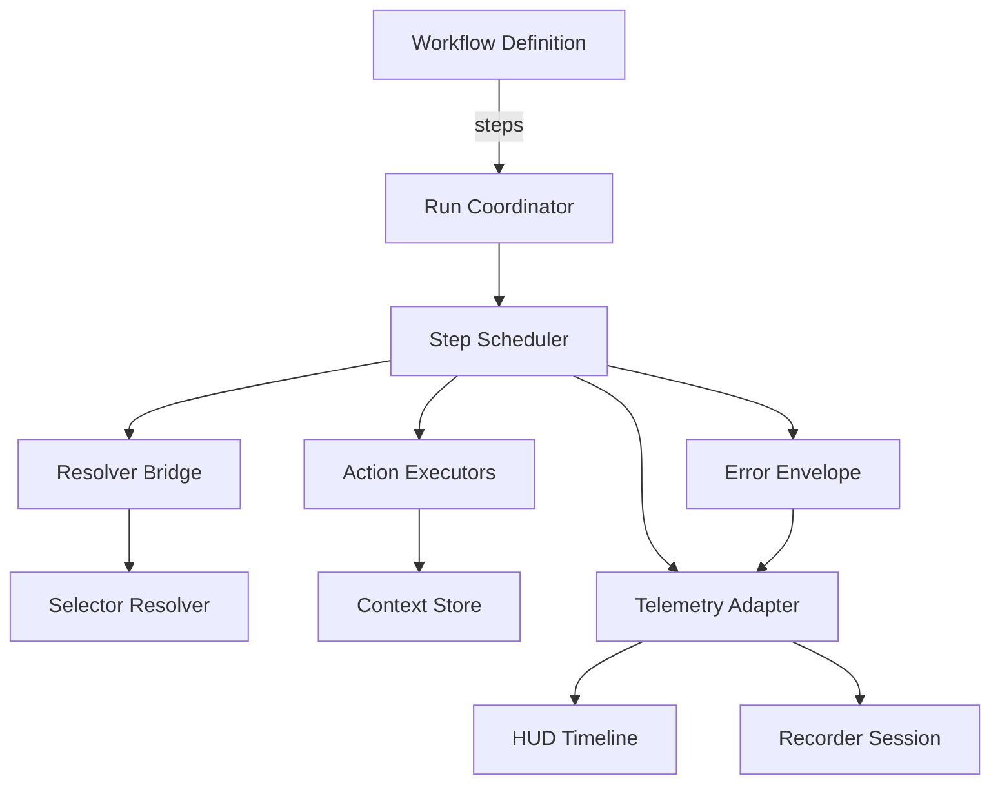

# Design Document

## Overview

The workflow executor turns validated DGX workflow definitions into deterministic browser actions. It sequences DSL steps, resolves logical keys via the selector resolver, enforces retry and timeout policies, orchestrates control-flow primitives, and emits telemetry for HUD and recorder consumers. The executor is the runtime counterpart to the DSL spec: it converts declarative data into repeatable automation while keeping context and observability aligned with product goals.

## Steering Document Alignment

### Technical Standards (tech.md)
- TypeScript-first implementation under `packages/workflows` with strict typing and no `eval` usage.
- Reuses existing GM storage adapters, BroadcastChannel sync, wait utilities, and `[DGX]` logging conventions to satisfy telemetry requirements.
- Honors performance budgets (≤150ms polling, ≤8s default timeouts) and privacy constraints (masked telemetry) defined in the technical charter.

### Project Structure (structure.md)
- Places runtime orchestration modules under `packages/workflows/src/engine` with dedicated barrels in `packages/workflows/src/index.ts` for downstream imports.
- Leverages package boundaries: selector resolution from `@core/resolve`, context from `@context/store`, HUD hooks from `@menu`, and recorder contracts from `@recorder` without creating circular dependencies.
- Aligns with modular design principles by isolating executor orchestration, action executors, telemetry adapters, and configuration helpers in separate files.

## Code Reuse Analysis

### Existing Components to Leverage
- **`@core/resolve`**: Provides the logical key resolution pipeline including strategy ordering, stability metadata, and telemetry hooks for misses.
- **`@core/utils/wait`**: Supplies exponential backoff utilities and polling helpers for retry logic and wait steps.
- **`@context/store`**: Maintains workflow context with TTL, snapshotting, and BroadcastChannel sync used by `setContext`, `capture`, and `foreach`.
- **`@menu/hud` telemetry APIs**: Consume executor events to update the HUD timeline and status badges.
- **`@recorder/session`**: Replays telemetry for recorded sessions; executor payloads must match these expectations.

### Integration Points
- **Action Executors (`packages/workflows/src/actions`)**: Executor dispatches per-step handlers responsible for DOM side effects, receiving resolved elements and context.
- **Telemetry Adapter (`packages/workflows/src/telemetry`)**: Executor publishes lifecycle events to HUD/recorder and optional analytics.
- **Workflow Registry (`packages/scripts/index.ts`)**: Registers workflows and injects resolver/context defaults when instantiating the executor per page module.

## Architecture

The executor is composed of four cooperating layers:
1. **Run Coordinator**: Accepts a `WorkflowDefinition`, wires dependencies, and tracks run-level metadata (id, start time, context snapshot).
2. **Step Scheduler**: Iterates steps sequentially (or recursively for `if`, `foreach`, `run`), manages retries/backoff, and enforces timing budgets.
3. **Resolver Bridge**: Invokes the selector resolver for keyed steps, captures attempt telemetry, and short-circuits when cancellation or retries exhaust.
4. **Telemetry & Error Layer**: Emits structured events, masks sensitive values, and converts thrown errors into typed `StepError` envelopes.



### Modular Design Principles
- **Single File Responsibility**: Separate files for run coordinator, scheduler, resolver bridge, telemetry adapter, and error types.
- **Component Isolation**: Executors reference injected dependencies through interfaces, enabling mocking during tests.
- **Service Layer Separation**: Page modules create executor instances; executor never imports HUD or recorder modules directly, relying on adapters instead.
- **Utility Modularity**: Backoff, timeout, and sanitizer helpers remain in shared utilities instead of being reimplemented in the executor.

## Components and Interfaces

### Run Coordinator (`packages/workflows/src/engine/runtime.ts`)
- **Purpose:** Initialize runs, merge defaults, hydrate context, and expose `runWorkflow`/`cancelRun` public APIs.
- **Interfaces:** `runWorkflow(definition, options)`, `createRunContext(config)`, `cancelRun(runId)`.
- **Dependencies:** Selector map, context store factory, telemetry adapter, logger.
- **Reuses:** DSL `WorkflowDefinition`, context store snapshots, telemetry event types shared with recorder.

### Step Scheduler (`packages/workflows/src/engine/scheduler.ts`)
- **Purpose:** Iterate steps, manage retries/backoff, evaluate control flow, and hand off to action executors.
- **Interfaces:** `executeStep(step, env)`, `executeBranch(steps, env)`.
- **Dependencies:** Resolver bridge, retry config helper, timeout guard.
- **Reuses:** `@core/utils/wait`, `@core/utils/time`.

### Resolver Bridge (`packages/workflows/src/engine/resolver.ts`)
- **Purpose:** Adapt logical key lookups to the resolver, logging strategy attempts and surfacing misses as typed errors.
- **Interfaces:** `resolveKey(step, env)`, `withResolvedElement(step, env, handler)`.
- **Dependencies:** `@core/resolve`, telemetry adapter for attempt logs.
- **Reuses:** Resolver telemetry builder, selector stability metadata.

### Telemetry Adapter (`packages/workflows/src/telemetry/runtime.ts`)
- **Purpose:** Normalize lifecycle events and deliver them to HUD/recorder while masking sensitive data.
- **Interfaces:** `record(event)`, `flush(runId)`, `onUpdate(listener)`.
- **Dependencies:** Sanitizer utilities, HUD event bus, optional analytics sink.
- **Reuses:** `[DGX]` logging conventions, recorder event schema.

### Error Envelope (`packages/workflows/src/engine/errors.ts`)
- **Purpose:** Represent resolver misses, timeouts, action failures, and cancellation in typed classes carrying breadcrumb context.
- **Interfaces:** `WorkflowStepTimeoutError`, `WorkflowResolverMissError`, `WorkflowExecutionError` with helper constructors.
- **Dependencies:** Step scheduler and telemetry adapter for consistent reporting.
- **Reuses:** Existing error base classes where available.

### Context Synchronizer (`packages/workflows/src/engine/context.ts`)
- **Purpose:** Provide read/write helpers that respect TTL, isolation, and snapshot semantics for control flow.
- **Interfaces:** `pushScope()`, `popScope()`, `commit()`, `snapshot()`.
- **Dependencies:** `@context/store`, BroadcastChannel for sync notifications.
- **Reuses:** Context store API to avoid duplicating storage logic.

## Data Models

### StepExecutionState
```
type StepExecutionState = {
  runId: string;
  workflowId: string;
  stepIndex: number;
  step: WorkflowStep;
  attempt: number;
  startedAt: number;
  resolved?: ResolveResult;
  error?: StepError;
};
```

### WorkflowRunRecord
```
type WorkflowRunRecord = {
  id: string;
  workflowId: string;
  startedAt: number;
  completedSteps: StepExecutionState[];
  status: "success" | "failed" | "cancelled";
  contextSnapshot: Record<string, unknown>;
  durationMs: number;
};
```

### TelemetryEvent
```
type TelemetryEvent = {
  type: "run" | "step";
  status: "start" | "attempt" | "success" | "failure" | "skipped" | "cancelled";
  runId: string;
  workflowId: string;
  stepIndex?: number;
  stepKind?: string;
  logicalKey?: string;
  attempt?: number;
  durationMs?: number;
  error?: StepError;
  timestamp: number;
};
```

## Error Handling

### Error Scenarios
1. **Resolver Miss:** Logical key resolution exhausts strategies.
   - **Handling:** Throw `WorkflowResolverMissError`, emit failure telemetry with attempted strategies, respect retry policy.
   - **User Impact:** HUD shows miss with logical key; recorder captures error details for debugging.

2. **Action Executor Failure:** DOM interaction throws or returns rejection.
   - **Handling:** Wrap in `WorkflowExecutionError`, allow retries based on policy, otherwise bubble to caller and flush telemetry.
   - **User Impact:** HUD displays failed step and suggests verifying selector or page state; context snapshot preserved for replay.

3. **Timeout or Cancellation:** Step exceeds timeout or run cancelled via hook.
   - **Handling:** Abort pending waits, throw `WorkflowStepTimeoutError` or mark as `cancelled`, ensure clean teardown of timers.
   - **User Impact:** Workflow stops gracefully; HUD shows cancellation reason and partial progress.

4. **Telemetry Adapter Failure:** External listener throws.
   - **Handling:** Catch and log at debug level; executor continues running to avoid cascading failures.
   - **User Impact:** Telemetry stream may omit consumer-specific updates but run completes with console logs intact.

## Testing Strategy

### Unit Testing
- Mock resolver/context/telemetry to validate retry logic, timeout enforcement, control flow branching, and cancellation semantics.
- Verify error envelopes carry logical key metadata and breadcrumb context.
- Ensure telemetry adapter masks sensitive payloads and respects optional injection.

### Integration Testing
- Run executor against synthetic DOM fixtures and mock HUD adapters to confirm telemetry ordering, context propagation, and nested workflow execution.
- Validate resolver bridge logs strategy attempts and handles stability metadata correctly.

### End-to-End Testing
- Execute sample workflows in userscript dev environment (Playwright or similar) to ensure executor cooperates with real action executors, HUD timeline, and recorder replay.
- Test failure modes (selector miss, timeout, cancellation) to confirm acceptance criteria 2.1–3.1 and observability standards are satisfied.
