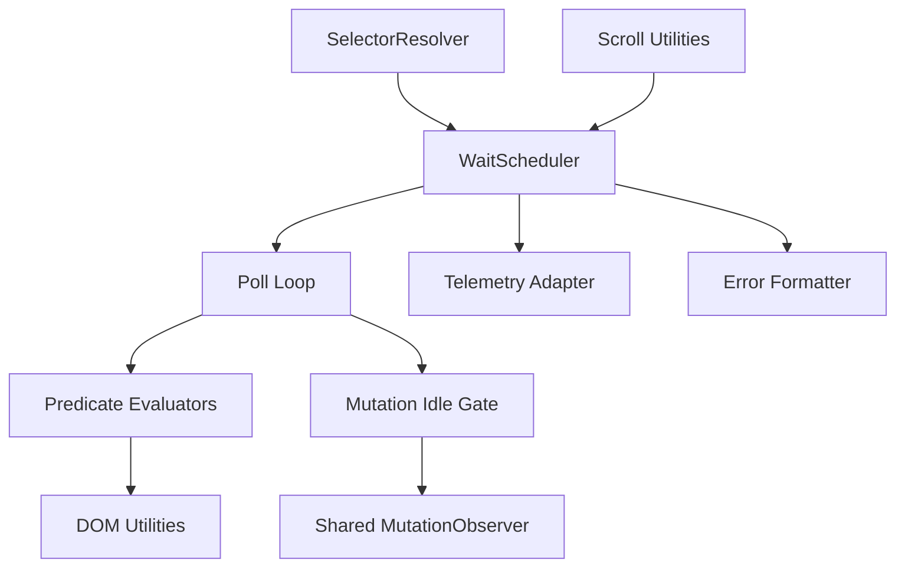

# Design Document

## Overview

The waiting and loading utilities provide a shared scheduling layer for DGX workflows that resolves logical selector keys, polls DOM state efficiently, and reports telemetry for HUD and recorder consumers. The design introduces modular helpers for element presence, text predicates, visibility checks, and mutation-idle windows while preserving the TypeScript-first architecture and cross-target compatibility demanded by userscript and MV3 builds.

## Steering Document Alignment

### Technical Standards (tech.md)
- Implements wait helpers in TypeScript under `packages/core/utils/wait`, reusing existing resolver, logging, and context primitives without introducing new dependencies.
- Observes steering performance ceilings (≤150ms polling, ≤8000ms default timeout) and `[DGX]` telemetry conventions for debugging.
- Leverages injected GM-safe timers and avoids `eval`, ensuring parity between userscript and MV3 builds.

### Project Structure (structure.md)
- Adds focused modules to `packages/core/utils/` and exports typed helpers through `packages/core/index.ts`, maintaining modular boundaries.
- Exposes orchestration factories for workflows via `packages/workflows`, letting page modules import preconfigured waits without breaking package layering.
- Stores configuration defaults alongside existing resolver utilities and reuses the centralized selector strategy map to avoid duplication.

## Code Reuse Analysis
- **Selector Resolver (`@core/resolve`)**: Supplies logical key lookup and fallback ordering. Wait utilities consume resolver responses, including stability metadata, to power diagnostics.
- **DOM Utilities (`@core/utils/dom`)**: Provides helpers for bounding box, visibility checks, and safe node comparisons.
- **Telemetry Adapter (`@workflows/telemetry` / HUD timeline)**: Receives structured wait events and renders progress/failure states for operators.
- **Context Store (`@context/store`)**: Offers optional TTL data for waits dependent on context-driven expectations, enabling dynamic predicate inputs.
- **Scroll Utilities (`@core/utils/scroll`)**: Integrates with waits that require scroller hydration (e.g., virtualized lists), sharing logic for presence thresholds.

### Existing Components to Leverage
- **waitUntil helper (if present)**: Either extend or replace prior simple polling utility with the new scheduler to maintain backward compatibility.
- **Resolver Strategy Map**: Reuse enumerations describing role/name/text/CSS/XPath precedence so that waits and resolver stay aligned.
- **HUD Event Bus**: Publish wait lifecycle events (`start`, `attempt`, `heartbeat`, `success`, `failure`) for consistent UI updates.

### Integration Points
- **Workflow Engine**: Accepts wait helpers through dependency injection, letting step executors (`waitFor`, `waitText`, `waitVisible`, `waitIdle`) call into the scheduler.
- **Recorder Exporter**: Inserts waits into exported workflows and attaches metadata describing predicate type and idle window expectations.
- **Debug Logger**: Uses shared `[DGX]` logging utilities to emit sanitized diagnostics across both targets.

## Architecture

The wait system is composed of layered modules that isolate responsibilities and simplify testing.



### Modular Design Principles
- **Single File Responsibility**: `scheduler.ts` coordinates timeouts and polls, `predicates/text.ts` handles text comparisons, `predicates/visibility.ts` computes display state, and `idle/gate.ts` manages mutation observers.
- **Component Isolation**: Each predicate module receives the resolved node and options, returning discrete status objects consumed by the scheduler.
- **Service Layer Separation**: Workflows and recorder code depend on exported interfaces (`createWaitHelpers`, `WaitResult`) rather than concrete implementations, enabling mock injection in tests.
- **Utility Modularity**: Shared constants (`DEFAULT_TIMEOUT_MS`, `DEFAULT_INTERVAL_MS`, `MAX_IDLE_WINDOW_MS`) live in `config.ts`, keeping tuning centralized.

## Components and Interfaces

### `WaitScheduler`
- **Purpose:** Coordinate polling loops, timeouts, and resolver retries.
- **Interfaces:** `waitFor(options)`, `waitVisible(options)`, `waitHidden(options)`, `waitText(options)`, `waitForIdle(options)`.
- **Dependencies:** Selector resolver, clock/timer abstraction, telemetry adapter, jitter generator, error formatter.
- **Reuses:** Default configuration values and existing resolver strategy metadata.

### `Predicate Evaluators`
- **Purpose:** Determine whether resolved elements satisfy text, visibility, or custom predicates.
- **Interfaces:** `evaluateText(node, expectation)`, `evaluateVisibility(node, criteria)`, `evaluateStale(node)`, returning `{ satisfied, snapshot, notes }`.
- **Dependencies:** DOM utilities for computed styles, bounding boxes, intersection, and sanitized text extraction.
- **Reuses:** Sanitizer utilities from recorder to mask sensitive captured text.

### `Mutation Idle Gate`
- **Purpose:** Observe DOM mutations and enforce idle windows before declaring readiness.
- **Interfaces:** `awaitIdle(targets, { idleMs, maxWindowMs })` returning a promise that resolves when the idle condition passes or rejects on timeout.
- **Dependencies:** Shared `MutationObserver` wrapper, scheduler timers, telemetry for heartbeat events.
- **Reuses:** Scroll utilities for virtualized list integration by watching scroller containers.

### `Error Formatter`
- **Purpose:** Produce structured errors and log payloads containing logical key, strategy attempts, elapsed time, and predicate snapshots.
- **Interfaces:** `formatTimeoutError(context)`, `formatResolverMiss(context)`, `formatVisibilityError(context)`.
- **Dependencies:** Selector resolver metadata, predicate snapshots, sanitized text diff utilities.
- **Reuses:** `[DGX]` logging helpers so HUD displays consistent narratives.

### Configuration Contracts
- **Purpose:** Encapsulate defaults and override merging for waits.
- **Interfaces:** `WaitDefaults`, `resolveTimeout(overrides)`, `resolveInterval(overrides)`, `resolveRetryPolicy(context)`.
- **Dependencies:** Workflow configuration store and environment-level overrides (e.g., debug mode forcing verbose logs).
- **Reuses:** Existing workflow engine default resolver to keep system-level settings consistent.

## Data Models

### `WaitOptions`
```
type WaitOptions = {
  key?: string;
  css?: string;
  xpath?: string;
  text?: string;
  textMode?: "exact" | "contains" | "regex";
  visibility?: "visible" | "hidden" | "any";
  timeoutMs?: number;
  intervalMs?: number;
  maxRetries?: number;
  idle?: { idleMs: number; maxWindowMs?: number };
  scrollerKey?: string;
  context?: WorkflowContext;
  debug?: boolean;
};
```

### `WaitResult`
```
type WaitResult = {
  node: Element;
  strategy: string;
  attempts: number;
  elapsedMs: number;
  predicateSnapshot?: Record<string, unknown>;
  staleRecoveries: number;
};
```

### `WaitError`
```
type WaitError = {
  code: "timeout" | "resolver_miss" | "idle_window_exceeded" | "visibility_mismatch";
  message: string;
  key?: string;
  strategyHistory: string[];
  elapsedMs: number;
  pollCount: number;
  predicateSnapshot?: Record<string, unknown>;
  lastMutationAt?: number;
};
```

## Error Handling

### Error Scenarios
1. **Resolver Exhausted:** All strategies fail before timeout.
   - **Handling:** Emit `[DGX] wait:resolver_miss` log with strategy history, throw `WaitError` code `resolver_miss`, and suggest registering selector metadata in recorder annotations.
   - **User Impact:** HUD highlights missing selector information and next steps.

2. **Timeout Without Predicate Satisfaction:** Predicate never resolves before timeout.
   - **Handling:** Scheduler cancels timers, records final predicate snapshot, and throws `WaitError` code `timeout`.
   - **User Impact:** HUD displays timeout with elapsed/poll counts; recorder recommends adjusting defaults.

3. **Idle Window Exceeded:** Mutation idle threshold not achieved.
   - **Handling:** Idle gate terminates observer, logs captured mutation stats, and throws `idle_window_exceeded`.
   - **User Impact:** Operators see mutation counts to tune `idleMs` or segmentation strategies.

4. **Visibility Mismatch:** Element found but fails visibility predicate.
   - **Handling:** Retry until timeout with visibility notes; on failure throw `visibility_mismatch` and include computed styles.
   - **User Impact:** HUD guidance suggests verifying CSS/display toggles or alternative selectors.

5. **Stale Node During Polling:** Node detaches between polls.
   - **Handling:** Scheduler re-runs resolver within retry limits, increments `staleRecoveries`, and logs recovery events.
   - **User Impact:** Recorder surfaces dynamic UI note and invites adding idle waits or scroller hints.

## Testing Strategy

### Unit Testing
- Mock resolver responses to simulate strategy fallbacks, stale nodes, and mismatched visibility states.
- Validate predicate evaluators against synthetic DOM fixtures (JSDOM) covering exact/contains/regex text matches and opacity/bounding box variations.
- Test idle gate timing logic with fake timers, ensuring idle windows resolve and max thresholds trigger errors.

### Integration Testing
- Compose scheduler with real resolver + DOM fixtures to verify telemetry events, heartbeat logging, and structured errors.
- Simulate virtualized list scenarios to test `presenceThreshold` and `scrollerKey` coordination with scroll utilities.
- Confirm recorder export + workflow engine integration by executing `waitFor` and `waitText` steps end-to-end with instrumentation.

### End-to-End Testing
- Run Playwright scenarios on sample pages featuring skeleton loaders, virtualization, and rapid DOM churn to validate wait resilience.
- Capture HUD telemetry snapshots demonstrating wait progress, heartbeat logs, and error narratives for regression baselines.
