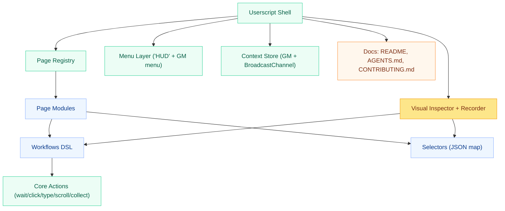
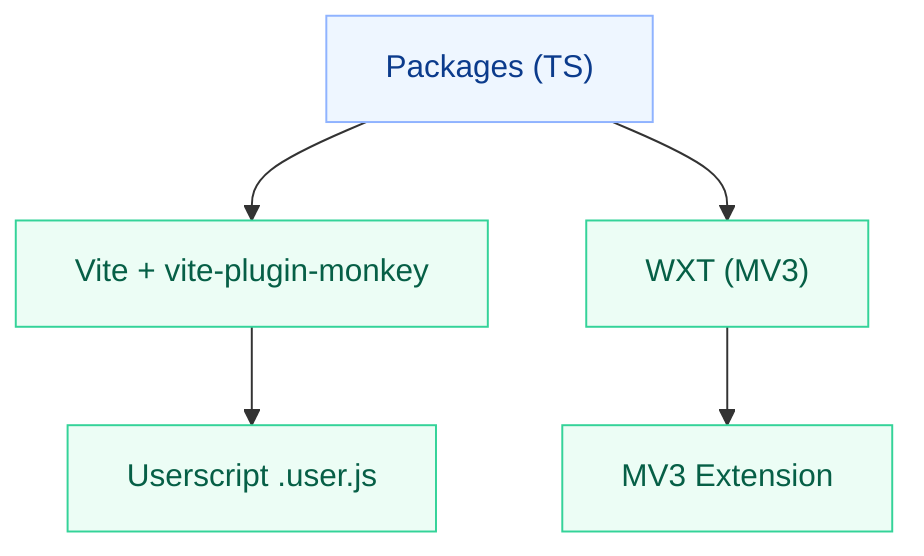
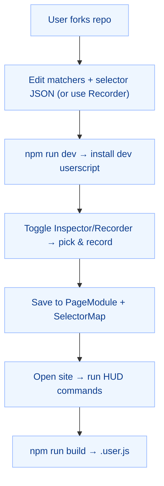

# Project: DGX Modular Userscripts Foundation

**Author:** DevGuyRash  
**Repo Type:** Public, forkable template  
**Primary Target:** Tampermonkey & Violentmonkey userscripts (TypeScript, Vite, vite-plugin-monkey)  
**Optional Target:** MV3 browser extension (WXT) — same code, different output  
**Build Tooling:** Node + TypeScript + Vite (+ vite-plugin-monkey), WXT for MV3; **no webpack**  
**Principles:** DRY, SOLID, KISS, modular, scalable, selector-robust, spec-driven, recorder-first authoring

## 1) Problem & Goals

We need a reusable, non-brittle **“Swiss Army Knife”** scaffold for building per-page, per-workflow automation as userscripts (Tampermonkey/Violentmonkey) that can:

- Provide **declarative workflows** (click/type/wait/scroll/collect/etc.).
- Maintain **shared state across pages/tabs**.
- Offer **modern, customizable menus** (HUD + native userscript menus), scoped per page.
- Use **robust selector strategies** to minimize breakage (role/label/text → data attr → CSS/XPath).
- Support **“scroll until …”** patterns and list extraction (e.g., collect all items under a parent).
- Avoid webpack; prefer **Vite + vite-plugin-monkey** for userscripts; **WXT** for an optional extension build.
- Ship a forkable **GitHub template repo**, with **README**, **AGENTS.md**, and docs an AI Agent can follow.
- Provide a **Visual Inspector + Recorder** that lets authors:
  - Hover/pick elements with an outline.
  - See **selector suggestions** ranked by stability (role/name/label/test id/css/xpath).
  - Record interactions (click/type/select/scroll/etc.) as **workflow steps** referencing **logical keys**.
  - Map recorded elements to **selector entries** in site JSON with one click.
  - Customize which strategy to use (id, short CSS, data-* attr, text, role+name, XPath, etc.).
  - Handle scrollbars by recording **which container** scrolled and how to reliably reproduce the scroll (e.g., `scrollUntil`).

**Non-goals (initial release):**
- No remote code hosting/chunk delivery for userscripts.
- No full RPA/desktop automation outside the browser.
- No backend services (pure client-side storage).

## 2) Success Criteria

- **DX:** A new page + workflow can be added in ≤10 minutes by editing JSON selectors and a PageModule file **or by recording and saving**.
- **Reliability:** Selectors degrade gracefully; workflows expose clear misses (“selector miss: key”).
- **Reusability:** Shared components (menu, context, engine) are used across pages without duplication.
- **Portability:** Same codebase can build a userscript and an MV3 extension without refactors.
- **Docs:** An AI Agent can implement new pages with **only** README + AGENTS.md + inline JSDoc.
- **Recorder:** Visual Inspector shows an overlay, suggests multiple selector strategies with stability scores, and saves recorded steps that **all** reference logical keys (no raw CSS in steps).
- **Traceability:** Recorder emits a **timeline log**; each recorded step is editable and re-runnable from HUD.
- **Privacy:** Typed secrets can be masked and turned into **context placeholders**.

## 3) Constraints

- **Userscript managers:** Tampermonkey & Violentmonkey.
- **APIs/Grants:** `GM_getValue`, `GM_setValue`, `GM_deleteValue`, `GM_addValueChangeListener`, `GM_removeValueChangeListener`, `GM_registerMenuCommand`, `GM_addStyle`.
- **Storage:** Userscript storage keys are **per script**; cross-tab sync via GM listeners + `BroadcastChannel`.
- **No webpack**; use Vite + vite-plugin-monkey for dev/build.
- **Security:** Respect page CSP; avoid `unsafe-eval`. Overlay and Inspector use only injected CSS/DOM.
- **Performance:** Avoid heavy polling; cap intervals; bail on long waits with clear logs.
- **Recorder Scope:** Operates **inside the page**; no devtools protocols. Scroll/file-upload/network recording kept within web constraints (see functional notes).

## 4) Personas

- **Script Author (you):** Builds page workflows without deep browser API knowledge. Can record and refine.
- **AI Agent:** Extends repo per specs; adds pages/keys/workflows by following schemas and contribution steps.
- **Power User:** Runs workflows via HUD or native TM/VM menu; configures options per page.

## 5) High-Level Architecture



## 6) Repository Structure (target)

```
/ (root)
  package.json               # workspaces, scripts
  tsconfig.base.json
  README.md                  # how to install/use/build/test
  AGENTS.md                  # spec-driven instructions for AI contributors
  CONTRIBUTING.md            # coding standards, PR checks
  RECORDER.md                # using the Visual Inspector + Recorder
  LICENSE

  packages/
    core/                    # DOM utils, wait, debug, resolver
      src/
        locators.ts
        utils/{dom.ts,wait.ts,debug.ts}
        resolve.ts
        index.ts

    context/                 # GM storage + BroadcastChannel
      src/{store.ts,index.ts}

    menu/                    # HUD + GM menu integration
      src/{hud.ts,tm-menu.ts,index.ts}

    workflows/               # DSL + engine
      src/{types.ts,engine.ts,index.ts}

    selectors/
      oracle.json            # example logical selector map
      # additional site maps as needed

    inspector/               # Visual Inspector (overlay + picker)
      src/{overlay.ts,picker.ts,selector-suggest.ts,sanitize.ts,index.ts}

    recorder/                # Recording session + step builder
      src/{session.ts,serialize.ts,to-workflow.ts,hotkeys.ts,index.ts}

    scripts/                 # shell + page modules (all bundled into one userscript)
      index.ts               # page registry (imports pages, mounts HUD, registers GM menu, recorder toggle)
      oracle/
        edit-page.ts         # example
        cases-page.ts        # example

  apps/
    userscripts/             # Vite + vite-plugin-monkey (userscript build)
      package.json
      tsconfig.json
      vite.config.ts         # includes path aliases
      (dist/)                # .user.js output

    wxt-extension/           # Optional MV3 build target (WXT)
      package.json
      tsconfig.json
      wxt.config.ts
      src/entrypoints/content.ts
```

## 7) Functional Requirements

### 7.1 Selector System (non-brittle)

- **FR-SEL-1:** Define a **SelectorMap JSON** per site with logical keys.
- **FR-SEL-2:** Each key includes an **ordered list of strategies**:
  1. by role/name/label/text
  2. by test id / data attr
  3. CSS
  4. XPath (last resort)
- **FR-SEL-3:** Resolver tries strategies in order until it finds an element; logs misses.
- **FR-SEL-4:** Selector entries can include **notes**, **tags** (e.g., `["primary-action"]`), and **stabilityScore** (recorder suggested).
- **FR-SEL-5:** Optional **scoped root** for a key (e.g., within a modal/container key) to reduce collisions.

**SelectorMap JSON schema:**

```json
{
  "$schema": "dgx.selector-map@1",
  "logical_key": {
    "description": "short human desc",
    "scopeKey": "optional_container_key",
    "tags": ["optional", "labels"],
    "stabilityScore": 0.0,
    "tries": [
      { "type": "role",     "role": "button", "name": "Save" },
      { "type": "text",     "text": "Save",   "exact": false },
      { "type": "dataAttr", "key": "data-testid", "value": "save-btn" },
      { "type": "css",      "css": "button[aria-label='Save']" },
      { "type": "xpath",    "xpath": "//button[@aria-label='Save']" }
    ]
  }
}
```

### 7.2 Workflow Engine (declarative DSL)

- **FR-WF-1:** Support steps: `click`, `type`, `select`, `waitFor`, `waitText`, `delay`, `setContext`, `if`.
- **FR-WF-2:** Each step uses only **logical selector keys** (from SelectorMap) — never raw CSS in step definitions (except optional `waitFor.css`/`xpath`).
- **FR-WF-3:** Provide **timeouts** and **intervals** with sane defaults; log on timeout.
- **FR-WF-4:** **Conditionals** (`if`) allow flow branching on context/url/exists.
- **FR-WF-5:** Support **additional step kinds** to cover more UI patterns.
- **FR-WF-6:** Support **templating** in text fields using `${ctx:path}` and `${env:NAME}`.
- **FR-WF-7:** Provide **retry policy** per step (`retries`, `backoffMs`, `jitterMs`).
- **FR-WF-8:** Steps can include a `name?: string` and `debug?: boolean` to aid logs.

**Workflow types (TypeScript):**

```ts
// Core step union
type StepBase = {
  name?: string;
  timeout?: number;
  retries?: number;
  backoffMs?: number;
  jitterMs?: number;
  debug?: boolean;
};

type Step =
  | ({ kind: "click"; key: string } & StepBase)
  | ({ kind: "hover"; key: string } & StepBase)
  | ({ kind: "focus"; key: string } & StepBase)
  | ({ kind: "blur"; key: string } & StepBase)
  | ({ kind: "type"; key: string; text?: string; fromCtx?: string } & StepBase)
  | ({ kind: "paste"; key: string; text?: string; fromCtx?: string } & StepBase)
  | ({ kind: "select"; key: string; value?: string; fromCtx?: string } & StepBase)
  | ({ kind: "keypress"; key: string; code?: string; keyValue?: string; modifiers?: { alt?: boolean; ctrl?: boolean; meta?: boolean; shift?: boolean } } & StepBase)
  | ({ kind: "waitFor"; key?: string; css?: string; xpath?: string; text?: string; exact?: boolean; timeout?: number } & StepBase)
  | ({ kind: "waitText"; text: string; exact?: boolean; withinKey?: string; timeout?: number } & StepBase)
  | ({ kind: "scrollIntoView"; key: string; block?: ScrollLogicalPosition } & StepBase)
  | ({ kind: "scrollUntil"; options: ScrollUntilOptions } & StepBase)
  | ({ kind: "collectList"; options: CollectOptions; toCtx?: string } & StepBase)
  | ({ kind: "setContext"; path: string; value?: unknown; fromKey?: string; fromText?: string; fromAttr?: string; fromHtml?: boolean; ttlMs?: number } & StepBase)
  | ({ kind: "capture"; to: string; from: { key?: string; attr?: string; text?: boolean; regex?: string; group?: number } } & StepBase)
  | ({ kind: "assert"; check: Assertion } & StepBase)
  | ({ kind: "delay"; ms: number } & StepBase)
  | ({ kind: "log"; message: string } & StepBase)
  | ({ kind: "run"; workflowId: string } & StepBase)
  | ({ kind: "if"; when: Condition; then: Step[]; else?: Step[] } & StepBase)
  | ({ kind: "foreach"; listCtx: string; as: string; steps: Step[] } & StepBase);

type Condition =
  | { type: "ctxEq"; path: string; value: unknown }
  | { type: "ctxMatches"; path: string; regex: string }
  | { type: "urlIncludes"; part: string }
  | { type: "exists"; key: string }
  | { type: "notExists"; key: string }
  | { type: "textIncludes"; key: string; text: string; exact?: boolean };

type Assertion =
  | { kind: "exists"; key: string }
  | { kind: "notExists"; key: string }
  | { kind: "textContains"; key: string; text: string }
  | { kind: "attrEq"; key: string; attr: string; value: string }
  | { kind: "ctxEq"; path: string; value: unknown };
```

### 7.3 Waiting & Loading

- **FR-WAIT-1:** `waitFor` checks: selector key, CSS, XPath, or visible text; returns element or times out.
- **FR-WAIT-2:** `waitText` finds text within a specified container (by key) or whole document.
- **FR-WAIT-3:** Provide `sleep(ms)` and `waitFor<T>(fn)` utilities.
- **FR-WAIT-4:** Provide `waitForMutation(root?, options?)` using `MutationObserver` to detect DOM changes.
- **FR-WAIT-5:** Provide `waitForVisible(key)` convenience wrapper.

### 7.4 Clicking, Typing, Selecting

- **FR-ACT-1:** `click(el)` uses HTMLElement click; highlight target briefly for debug.
- **FR-ACT-2:** `type(el, text)` sets value and dispatches `input` event; optional `enter` send.
- **FR-ACT-3:** `selectValue(el, value)` sets value and dispatches `change`.
- **FR-ACT-4:** `hover(el)` dispatches `pointerover/mouseover`.
- **FR-ACT-5:** `keypress(el, opts)` dispatches `keydown/keyup` with modifiers.

### 7.5 Scrolling & “Scroll Until …”

- **FR-SCR-1:** `scrollTo(el|container, {x?, y?})` and directional helpers.
- **FR-SCR-2:** `scrollIntoView(key)` via logical selector.
- **FR-SCR-3:** `scrollUntil(options)` supports:
  - **until end of container** (no more scroll height change)
  - **until end of page**
  - **until element exists** (by logical key/CSS/XPath)
  - **until list length stops increasing** (with parent key)
  - **until timeout or max iterations**
- **FR-SCR-4:** Detect scroll container (element or `document.scrollingElement`).
- **FR-SCR-5:** Recorder identifies **which container** is scrolling (nearest overflowed ancestor) and converts raw scroll deltas into a reproducible **`scrollUntil`** step when possible.

**ScrollUntil signature (TS):**

```ts
type ScrollUntilOptions = {
  containerKey?: string;      // logical key; else page scroll
  stepPx?: number;            // default 600
  maxSteps?: number;          // default 50
  delayMs?: number;           // default 200
  until?: 
    | { kind: "end" }
    | { kind: "element"; key?: string; css?: string; xpath?: string }
    | { kind: "listGrowth"; parentKey: string; itemCss?: string }
    | { kind: "predicate"; fn: () => boolean }; // agent-supplied inline
  timeoutMs?: number;         // hard cap
};
```

### 7.6 List Extraction

- **FR-LST-1:** `collectList({ parentKey, itemKey?, itemCss?, to: "text"|"html"|"attrs", attrs?: string[] })`.
- **FR-LST-2:** Return array of items; allow mapping to plain text, inner HTML, or selected attributes.
- **FR-LST-3:** Option: `dedupe` by text/attr; `limit` count.
- **FR-LST-4:** Option: `map` function to transform each element to a shape `{title, href, ...}` (inline or by config).

### 7.7 Menus (HUD + Native Menu)

- **FR-UI-1:** Floating **HUD** (DGX button) opens a searchable command palette (page-specific).
- **FR-UI-2:** Native **GM/VM menu** commands mirror the same page workflows.
- **FR-UI-3:** Per-page **options/settings** via a minimal config UI (modal under HUD) with `GM_setValue`.
- **FR-UI-4:** HUD includes **Recorder toggle** and **Inspector** quick actions.
- **FR-UI-5:** HUD shows **last run**, **status badges**, and access to **timeline logs**.

### 7.8 Shared State (Cross Page/Tab)

- **FR-CTX-1:** `ContextStore` API: `get`, `set`, `delete`, `subscribe`.
- **FR-CTX-2:** Backed by `GM_*` storage; broadcast sync via `GM_addValueChangeListener` + `BroadcastChannel`.
- **FR-CTX-3:** Optional TTL per key; expired keys auto-purge on read.
- **FR-CTX-4:** Namespaced contexts per page id (`page.ns`) with override precedence.

### 7.9 Page Modules & Registry

- **FR-PG-1:** Each page exports `PageModule` with: `id`, `label`, `matches(url)`, `selectors`, `workflows`.
- **FR-PG-2:** Shell registers **only** modules whose `matches(url)` return true; builds one userscript.
- **FR-PG-3:** Page modules may declare **default HUD commands**, **hotkeys**, and **recorder presets**.

### 7.10 Visual Inspector + Recorder

- **FR-REC-1:** **Inspector overlay** draws an outline on hovered elements; shows a tooltip with:
  - tag, id, classes, role/name/label, data-* attrs, text summary.
  - a **stability score** for suggested strategies.
- **FR-REC-2:** **Element pick**: click to select; `Esc` cancels; `[` / `]` cycle ancestors; `←/→` cycle siblings; `.` lock/unlock.
- **FR-REC-3:** **Selector Suggestions** (ranked):
  1. role + accessible name
  2. data-testid / stable `data-*`
  3. `id` (if stable-looking)
  4. short **unique** CSS (prefers attribute selectors; avoids nth-child where possible)
  5. visible text (normalized)
  6. XPath (last resort)
- **FR-REC-4:** **Record actions**:
  - Clicks (left-button), hovers, focus/blur.
  - Typing/paste in textboxes/textareas/contenteditable (with toggle to **mask**).
  - Select changes (`<select>`, ARIA combobox), radio/checkbox toggles.
  - Scroll: page or nearest scroll container; offer to convert to `scrollIntoView` or `scrollUntil`.
  - Keypresses (Enter/Escape/Tab combos).
- **FR-REC-5:** After each action, prompt to:
  - **Map to logical key** (new or existing).
  - Pick preferred **selector strategy**; others saved as fallbacks.
  - Add a human **description** and optional **tags**.
- **FR-REC-6:** **Timeline panel** lists recorded steps; edit/reorder/delete; convert free-form to DSL.
- **FR-REC-7:** **Save as workflow**: choose `PageModule` and `workflowId`; write:
  - selectors into `packages/selectors/<site>.json`
  - steps into `packages/scripts/<site>/<page>.ts`
- **FR-REC-8:** **Privacy/Safety**:
  - Mask typed values by default; offer `${ctx:...}` placeholders.
  - Redact detected PII patterns (email, phone) unless author opts in.
- **FR-REC-9:** **Hotkeys**: `Alt+R` toggle recorder; `Alt+P` pick element; `Alt+S` save; `Alt+L` run last workflow.
- **FR-REC-10:** **No eval**; overlay styles via `GM_addStyle`; z-index safe; cleans up on unload.

**Recorder entities (TypeScript):**

```ts
type SelectorStrategy =
  | { type: "role"; role: string; name?: string }
  | { type: "text"; text: string; exact?: boolean }
  | { type: "dataAttr"; key: string; value?: string }
  | { type: "id"; id: string }
  | { type: "css"; css: string }
  | { type: "xpath"; xpath: string };

type SuggestedSelector = {
  strategy: SelectorStrategy;
  stabilityScore: number; // 0.
  uniqueInScope: boolean;
  notes?: string;
};

type RecordedAction =
  | { kind: "click"; target: Element }
  | { kind: "hover"; target: Element }
  | { kind: "focus"; target: Element }
  | { kind: "blur"; target: Element }
  | { kind: "type"; target: Element; text: string; masked?: boolean }
  | { kind: "paste"; target: Element; text: string; masked?: boolean }
  | { kind: "select"; target: Element; value: string }
  | { kind: "toggle"; target: Element; checked: boolean }
  | { kind: "scroll"; container: Element | Document; dx: number; dy: number }
  | { kind: "keypress"; target: Element; code?: string; key?: string; modifiers?: { alt?: boolean; ctrl?: boolean; meta?: boolean; shift?: boolean } };

type RecorderMapping = {
  logicalKey: string;                 // chosen by author or auto
  chosen: SuggestedSelector;          // primary strategy
  fallbacks: SuggestedSelector[];     // additional strategies in order
  description?: string;
  scopeKey?: string;
};

type RecordedStep = {
  action: RecordedAction;
  mapping?: RecorderMapping;
  // derived DSL step after transformation
  toStep?: Step;
};
```

### 7.11 Selector Heuristics & Stability

- Prefer semantics: **role/name/label/test id** over CSS.
- De-prioritize volatile attributes (dynamic class hashes, inline styles).
- Score by:
  - **uniqueness** in scope
  - **semantic strength** (role/name > testid > id > css > xpath)
  - **text length** and normalization (avoid full paragraphs)
  - **id stability** hint (no GUID-like patterns unless unique & consistent)
- Surface score and reasoning in Inspector tooltip.

### 7.12 Safety & Privacy

- Mask typed inputs by default; provide toggle **“use context placeholder”** → `${ctx:secrets.password}`.
- Never store masked plaintext in selector map or workflow files.
- Provide `sanitize.ts` utilities for redaction and safe logging (e.g., `[***masked***]`).

### 7.13 Advanced Waits

- `waitForIdle(opts)` optionally uses micro-delays and `MutationObserver` quiescence windows.
- `waitForAttr(key, attr, value?)` helper.
- `waitForEnabled(key)` checks `disabled/aria-disabled`.

### 7.14 Looping, Templates, and Data

- `foreach` over arrays stored in context (e.g., list scraped by `collectList`).
- `${ctx:path}` and `${env:NAME}` templating in `text`, `value`, and `message` fields.
- **Capture** step pulls text/attr from elements to context for later reuse.

### 7.15 Error Handling & Retries

- Per-step retries with exponential backoff + jitter.
- `onFail?: Step[]` (inline try/catch-like) — **(post-MVP optional)**.
- Clear timeout messages: include **key**, **strategy attempts**, and **last seen** element snapshot.

### 7.16 Assertions

- Built-in `assert` step for **exists**, **notExists**, **textContains**, **attrEq**, and **ctxEq** to verify outcomes.

### 7.17 Keyboard & Hotkeys

- Global recorder hotkeys; page-defined workflow hotkeys.
- `keypress` step supports modifier combos.

### 7.18 Import/Export

- Export recorded workflow as JSON snippet to paste into `PageModule`.
- Optional import merges selectors into `packages/selectors/<site>.json` (respects existing keys; asks to append new tries).

## 8) Non-Functional Requirements

- **NFR-Perf:** Default polling interval ≤ 150ms; default timeouts ≤ 8s (configurable).
- **NFR-Compat:** Chrome, Firefox; Tampermonkey & Violentmonkey; MV3 extension via WXT.
- **NFR-DX:** Path aliases, TypeScript strict mode, top-notch JSDoc.
- **NFR-Logging:** Prefixed logs `[DGX] ...`; misses and timeouts are obvious.
- **NFR-Accessibility:** Prefer role/name/label strategies first.
- **NFR-Recorder-UX:** Overlay responsive under heavy pages; outline 60fps where possible; minimal layout shift.

## 9) Build & Tooling

- **Userscripts:** Vite + **vite-plugin-monkey** → `.user.js`; dev server emits install URL; live reload.
- **Aliases:** Configure Vite `resolve.alias` for `@core`, `@workflows`, `@menu`, `@context`, `@selectors`, `@inspector`, `@recorder`.
- **Extension (optional):** **WXT** app composes the same code as a content script; no webpack.
- **Lint/Typecheck (optional):** ESLint + TS strict; commit hooks.
- **No `GM_xmlhttpRequest`** dependency (not required for MVP).
- **CSP Notes:** Use `GM_addStyle` for overlay; avoid inline scripts; feature detect.



## 10) Public API (for workflows & utilities)

**Core DOM & Resolver**

```ts
// @core/utils/dom
function q(root: ParentNode, css: string): Element | null
function byText(root: ParentNode, text: string, exact?: boolean): Element | null
function byRole(root: ParentNode, role: string, name?: string): Element | null
function byDataAttr(root: ParentNode, key: string, value?: string): Element | null
function byLabelFor(root: ParentNode, text: string): Element | null
function byXpath(root: ParentNode, xpath: string): Element | null
function click(el: Element): void
function type(el: Element, text: string): void
function selectValue(el: Element, value: string): void

// @core/resolve
type SelectorMap = Record<string, {
  description?: string
  scopeKey?: string
  tags?: string[]
  stabilityScore?: number
  tries: Array<
    | { type: "role"; role: string; name?: string }
    | { type: "text"; text: string; exact?: boolean }
    | { type: "dataAttr"; key: string; value?: string }
    | { type: "id"; id: string }
    | { type: "css"; css: string }
    | { type: "xpath"; xpath: string }
  >
}>
function resolve(map: SelectorMap, key: string, root?: ParentNode): Element | null
```

**Wait & Sleep**

```ts
// @core/utils/wait
function sleep(ms: number): Promise<void>
function waitFor<T>(fn: () => T | null, opts?: { timeout?: number; interval?: number }): Promise<T | null>
function waitForVisible(key: string, opts?: { timeout?: number; interval?: number }): Promise<Element | null>
function waitForMutation(root?: Node, opts?: MutationObserverInit & { timeout?: number }): Promise<boolean>
```

**Scroll & Collect**

```ts
// @core/utils/scroll
function getScrollContainer(el?: Element): Element | Document
function scrollToTarget(target: Element | Document, dx: number, dy: number): void
function scrollIntoViewKey(key: string, block?: ScrollLogicalPosition): Promise<void>
function scrollUntil(opts: ScrollUntilOptions): Promise<{ reason: string; steps: number }>

// @core/utils/collect
type CollectOptions = {
  parentKey: string
  itemKey?: string
  itemCss?: string
  to?: "text" | "html" | "attrs"
  attrs?: string[]
  dedupe?: boolean | { by: "text" | "attr"; attr?: string }
  limit?: number
  map?: (el: Element) => any
}
function collectList(opts: CollectOptions): Promise<any[]>
```

**Context Store**

```ts
// @context/store
class ContextStore {
  constructor(impl?: StorageAdapter, ns?: string)
  get<T=unknown>(path: string): Promise<T | null>
  set<T=unknown>(path: string, value: T, ttlMs?: number): Promise<void>
  delete(path: string): Promise<void>
  subscribe(cb: (key: string, value: unknown) => void): () => void
}
```

**Workflows Engine**

```ts
// @workflows/engine
class WorkflowEngine {
  constructor(ctx?: ContextStore)
  run(page: PageModule, workflowId: string): Promise<void>
}
function registerCommandsForPage(page: PageModule, engine: WorkflowEngine): { id: string; label: string; run: () => void }[]
```

**Menu Layer**

```ts
// HUD (in-page command palette)
function mountHUD(commands: { id: string; label: string; run: () => void }[], opts?: { showRecorder?: boolean }): void

// Native menu (TM/VM)
function registerTMMenu(commands: { id: string; label: string; run: () => void }[]): void
```

**Inspector + Recorder**

```ts
// @inspector
type Inspector = {
  start(): void
  stop(): void
  pickOnce(): Promise<Element | null>
  suggest(el: Element): SuggestedSelector[]
}
function createInspector(): Inspector

// @recorder
type RecorderSession = {
  start(): void
  stop(): void
  isActive(): boolean
  steps(): RecordedStep[]
  toWorkflow(pageId: string, workflowId: string): { selectors: SelectorMap; steps: Step[] }
}
function createRecorder(inspector: Inspector, opts?: { maskInputDefault?: boolean }): RecorderSession
```

## 11) Documentation Deliverables

### 11.1 README.md

- What is this? One userscript, many pages, declarative workflows.
- Install: Tampermonkey/Violentmonkey → dev install URL → build `.user.js`.
- Configure domain matches (`vite.config.ts`), add pages, add selectors.
- Example: create a page + workflow in 10 minutes (copy/paste **or record**).
- Troubleshooting: alias issues, matchers, selector miss logs, CSP gotchas, **recorder overlay conflicts**.

### 11.2 AGENTS.md (for AI Agents)

- **Ground rules:** No webpack; respect file structure; TypeScript strict; no breaking public APIs without a spec change.
- **How to add a page:**
  1. Create `packages/scripts/<site>/<page>.ts` exporting `page: PageModule`.
  2. Register in `packages/scripts/index.ts` `pages` array.
  3. Add logical keys to `packages/selectors/<site>.json`.
  4. (Optional) Use **Recorder** to generate both.
- **Selector strategy order:** role/name/label/text → data-testid → CSS → XPath.
- **When to introduce new core utilities:** Must add types + JSDoc + unit usage example in docs.
- **PR checklist:** builds pass; dev URL works; demo workflow succeeds; docs updated.
- **Commit style:** Conventional Commits; short scope tags (`core`, `workflows`, `menu`, `selectors`, `inspector`, `recorder`, `docs`).

### 11.3 CONTRIBUTING.md

- Node & npm versions; install steps.
- Dev scripts; build scripts.
- Lint/typecheck (optional add-on).
- How to run e2e smoke (manual steps).
- **Recorder** QA checklist: overlay visibility, keyboard nav, export correctness.

### 11.4 RECORDER.md

- How to toggle recorder; hotkeys.
- Picking elements; cycling ancestors/siblings.
- Choosing strategies; mapping to keys; saving.
- Handling scroll capture and converting to `scrollUntil`.
- Masking inputs and using `${ctx:...}`.
- Export → paste into `PageModule`.

## 12) Example Page & Workflow Spec (seed)

**PageModule (`packages/scripts/oracle/edit-page.ts`)**

- `id`: `"oracle-edit"`
- `label`: `"Oracle • Edit"`
- `matches(url)`: matches host `example.com` and path `/edit`.
- **Workflows:**
  - `click-edit-and-focus-notes`: waits for `edit_button`, clicks; waits for `notes_field`, focuses.
  - `type-notes-from-context`: types `oracle.notes` into `notes_field`.
  - `demo-set-notes-context`: `setContext("oracle.notes", "Hello from DGX!", ttl=1h)`.
  - **(Recorded Demo)** `recorded-fill-and-save`: steps generated by Recorder using keys `edit_button`, `notes_field`, `save_button`; with assertions.

**Selector keys (`packages/selectors/oracle.json`):**

- `edit_button`, `notes_field`, `save_button` with strategies suggested by Inspector (role/name preferred, fallbacks present).

**Recorded → DSL Example**

```ts
const recordedFillAndSave: Step[] = [
  { kind: "waitFor", key: "edit_button", timeout: 5000 },
  { kind: "click",   key: "edit_button" },
  { kind: "waitFor", key: "notes_field" },
  { kind: "focus",   key: "notes_field" },
  { kind: "type",    key: "notes_field", fromCtx: "oracle.notes" }, // masked during recording
  { kind: "assert",  check: { kind: "textContains", key: "notes_field", text: "Hello" } },
  { kind: "scrollUntil", options: { until: { kind: "element", key: "save_button" }, stepPx: 500, maxSteps: 10 } },
  { kind: "click",   key: "save_button" },
  { kind: "waitText", text: "Saved", exact: false, withinKey: "toast_area", timeout: 4000 }
];
```

## 13) Acceptance Criteria

1. **AC-1**: Installing dev userscript shows **DGX HUD** on any matching page; native menu entries exist.
2. **AC-2**: Running the demo workflows logs clear activity; highlights clicked targets.
3. **AC-3**: `setContext` then `type` with `fromCtx` works across page navigations.
4. **AC-4**: `scrollUntil({ until: { kind: "end" } })` terminates with a reason and step count; does not loop forever.
5. **AC-5**: `collectList` returns an array of items from within a parent container; supports `to: "text"` and `to: "attrs"`.
6. **AC-6**: Violentmonkey **and** Tampermonkey both work (grants present; menu registers; storage syncs).
7. **AC-7**: Optional WXT build compiles and injects the same logic as a content script (no code changes in packages).
8. **AC-8**: **Inspector overlay** appears with element outline, tooltip, and keyboard navigation; `Esc` cancels cleanly.
9. **AC-9**: **Recorder** logs click/type/select/scroll/key events; produces a **valid** list of `Step`s referencing logical keys.
10. **AC-10**: Recorder can propose multiple selector strategies with a displayed **stability score**, and saves the chosen + fallbacks into the site JSON.
11. **AC-11**: For scroll actions, Recorder either generates `scrollIntoView` or `scrollUntil` with the correct **container** or page scroll.
12. **AC-12**: Typing in sensitive fields is masked; exported steps use `${ctx:...}` or `fromCtx` instead of literals when masking was enabled.

## 14) Risks & Mitigations

- **Selector brittleness** → Favor semantic strategies (role/label/text/testid) before CSS/XPath; allow quick JSON edits; score and show stability in Inspector.
- **CSP limitations** → Userscripts usually inject; WXT extension available as fallback; avoid inline/eval.
- **Cross-script storage isolation** → Keep single-script model; if split later, use `BroadcastChannel`.
- **Infinite scrolling loops** → Hard caps, timeouts, and **no-change** detection; clear result object.
- **Overfitted selectors from Recorder** → Display uniqueness and scope; default to stable choices; permit scoping to container keys.
- **PII leakage** → Mask by default; redact logs; encourage `${ctx:...}`.
- **Overlay conflicts with site UI** → Namespaced CSS classes; configurable z-index; easy toggle off.

## 15) Roadmap (Post-MVP)

- Optional **visual selector inspector** (hover to build JSON entries). **(↑ delivered in MVP)**  
- **Replay/record** helper to turn user actions into draft workflow steps. **(↑ delivered in MVP)**
- Import/export **workflow packs** per site.
- Built-in **assert** step type for validations. **(↑ delivered in MVP)**
- **Side panel** UI (for extension build) with richer controls.
- **Auto-healing**: telemetry of selector misses to re-rank strategies.
- **Plugin API** for custom step kinds (e.g., drag-and-drop, file uploads in extension context).
- **Localization** for Inspector/HUD UI text.

## 16) Glossary

- **SelectorMap**: JSON mapping from logical names to ordered locating strategies.
- **Workflow**: Declarative list of steps; each step references logical keys and actions.
- **Page Module**: A bundle of workflows and selectors scoped by a `matches(url)` predicate.
- **HUD**: Floating command palette UI injected into the page.
- **Context Store**: Cross-page/tab key/value store on top of GM storage + BroadcastChannel.
- **Inspector**: In-page overlay for element picking and selector suggestion.
- **Recorder**: Captures user actions and converts them to workflow steps and selector entries.

## 17) Dev Tasks (for the AI Agent)

1. Initialize repo per **Repository Structure**.
2. Implement `core` utilities; unit smoke via demo page.
3. Implement `workflows` DSL + engine; include `if`, `waitFor`, `waitText`, **new step kinds**.
4. Implement `menu` (HUD + GM menu) with recorder toggle.
5. Implement `context` store with TTL and broadcast.
6. Implement **scroll utilities** and **collectList** per signatures.
7. Implement **Inspector** overlay: outline, tooltip, keyboard navigation, selector suggestions.
8. Implement **Recorder** session: event capture, mapping UI, step serialization, export-to-PageModule.
9. Add `packages/scripts/index.ts` registry and 2 demo pages.
10. Configure Vite aliases; add vite-plugin-monkey; ensure dev install URL works.
11. Add WXT app that imports `packages/scripts` content.
12. Author **README.md**, **AGENTS.md**, **CONTRIBUTING.md**, **RECORDER.md** with examples and troubleshooting.
13. Ship example **recorded workflow** and **selector map** produced via the Inspector.

## 18) User & Dev Flow



## Appendix A — Inspector/Recorder UX Details (Reference)

- **Overlay**: blue outline (4px), tooltip near cursor, avoids covering click target; portal root appended to `document.body`.
- **Tooltip data**: `<tag>#id.class1.class2`, role/name; text snippet (trimmed), data-* attrs (whitelist).
- **Strategy preview**: radio list with merits, e.g., `role+name (stable, unique)`, `data-testid=save-btn (unique)`, `id=btn-123 (unique, GUID-like)`.
- **Ancestor cycling**: `[` → parent, `]` → child; live uniqueness check updates scores.
- **Scroll capture**: detect container via `overflow` check and scroll event target; if an element appears after scroll, suggest `scrollUntil({ until: { kind: "element", key }, ... })`.
- **Typing**: offer `Mask input → ${ctx:...}`; if masked, prompt for context path.
- **Save flow**: choose target **PageModule** & `workflowId`; confirm file paths; show diff preview (where possible).
- **Run Now**: immediately execute generated workflow to validate selectors before saving.